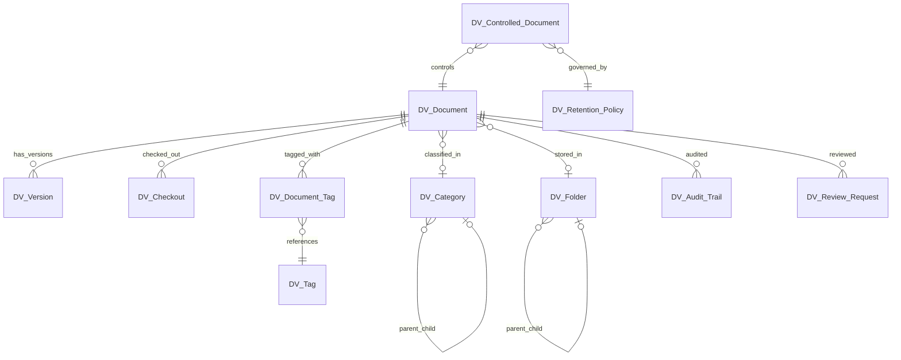

# DocVault — Architecture

## App Identity

| Property | Value |
|----------|-------|
| **App Name** | docvault |
| **Prefix** | DV |
| **Color** | `#059669` (Emerald) |
| **Version** | 0.0.1 |
| **License** | MIT |

## Required Apps

```
frappe >= 16.0.0
frappe_visual >= 0.1.0
arkan_help >= 0.0.1
base_base >= 0.0.1
```

## Module Map

| Module | DocTypes | Purpose |
|--------|----------|---------|
| DV Settings | DV Settings | Global app configuration |
| DV Core | DV Document, DV Folder, DV Version, DV Checkout | Core document management |
| Classification | DV Category, DV Tag, DV Document Tag | Document classification |
| DV Workflows | DV Review Request, DV Approval, DV Workflow Template | Review and approval |
| DV Compliance | DV Controlled Document, DV Retention Policy, DV Retention Schedule, DV Audit Trail | Compliance and retention |
| DV Search | DV Search Index, DV Saved Search | Full-text search |
| DV Collaboration | DV Comment, DV Share, DV Team Space | Collaboration tools |
| DV Integrations | DV External Link, DV Webhook | External integrations |
| DV Portal | DV Portal Access, DV Download Log | Portal for external users |

## Services

| Service | File | Responsibilities |
|---------|------|-----------------|
| DocumentService | `services/document_service.py` | CRUD, versioning, check-in/check-out |
| SearchService | `services/search_service.py` | Full-text search, indexing, saved searches |
| ComplianceService | `services/compliance_service.py` | Audit logging, review date checks |
| RetentionService | `services/retention_service.py` | Retention policy enforcement, archival |
| AnalyticsService | `services/analytics_service.py` | Document activity stats |

## API Endpoints (v1)

| Endpoint | Method | File |
|----------|--------|------|
| `docvault.api.v1.document.create_document` | POST | `api/v1/document.py` |
| `docvault.api.v1.document.upload_version` | POST | `api/v1/document.py` |
| `docvault.api.v1.document.checkout` | POST | `api/v1/document.py` |
| `docvault.api.v1.document.checkin` | POST | `api/v1/document.py` |
| `docvault.api.v1.search.search_documents` | GET | `api/v1/search.py` |

## CAPS Capabilities (20)

| Capability | Category | Description |
|------------|----------|-------------|
| DV_manage_settings | Module | Configure app settings |
| DV_create_documents | Action | Upload new documents |
| DV_edit_documents | Action | Edit document metadata |
| DV_delete_documents | Action | Delete documents |
| DV_view_documents | Module | View document list |
| DV_download_documents | Action | Download document files |
| DV_manage_versions | Action | Upload new versions |
| DV_checkout_documents | Action | Check out for editing |
| DV_manage_categories | Module | Create/edit categories |
| DV_manage_folders | Module | Create/edit folders |
| DV_manage_tags | Module | Create/edit tags |
| DV_manage_workflows | Module | Configure workflows |
| DV_approve_documents | Action | Approve/reject reviews |
| DV_manage_compliance | Module | Configure compliance |
| DV_manage_retention | Module | Configure retention policies |
| DV_view_audit_trail | Report | View audit trail |
| DV_manage_sharing | Action | Share documents |
| DV_portal_access | Module | Access portal features |
| DV_export_reports | Report | Export activity reports |
| DV_api_access | Action | Use API endpoints |

## ERD (Simplified)


