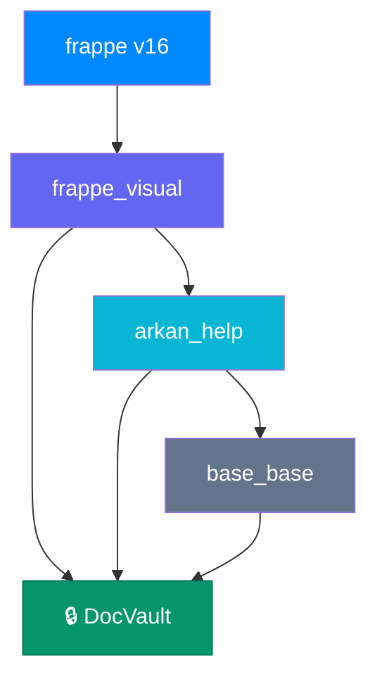

# DocVault — Dependency Graph
# مخطط التبعيات — DocVault

```mermaid
graph TD
    frappe["frappe v16"]
    frappe_visual["frappe_visual"]
    arkan_help["arkan_help"]
    base_base["base_base"]
    docvault["🔒 DocVault"]

    frappe --> frappe_visual
    frappe_visual --> arkan_help
    arkan_help --> base_base
    frappe_visual --> docvault
    arkan_help --> docvault
    base_base --> docvault

    style docvault fill:#059669,color:#fff,stroke:#047857
    style frappe fill:#0089FF,color:#fff
    style frappe_visual fill:#6366F1,color:#fff
    style arkan_help fill:#06B6D4,color:#fff
    style base_base fill:#64748B,color:#fff
```
