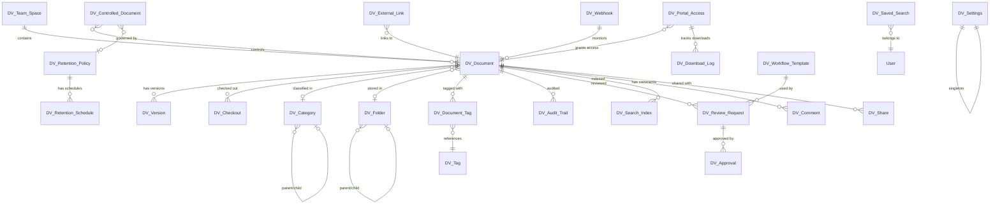

# DocVault — Entity Relationship Diagram
# مخطط علاقات الكيانات — DocVault

```mermaid
erDiagram
    DV_Settings ||--|| DV_Settings : singleton

    DV_Document ||--o{ DV_Version : "has versions"
    DV_Document ||--o{ DV_Checkout : "checked out"
    DV_Document }o--o| DV_Category : "classified in"
    DV_Document }o--o| DV_Folder : "stored in"
    DV_Document ||--o{ DV_Document_Tag : "tagged with"
    DV_Document_Tag }o--|| DV_Tag : "references"

    DV_Category }o--o| DV_Category : "parent/child"
    DV_Folder }o--o| DV_Folder : "parent/child"

    DV_Document ||--o{ DV_Audit_Trail : "audited"
    DV_Document ||--o{ DV_Review_Request : "reviewed"
    DV_Review_Request ||--o{ DV_Approval : "approved by"

    DV_Controlled_Document }o--|| DV_Document : "controls"
    DV_Controlled_Document }o--o| DV_Retention_Policy : "governed by"
    DV_Retention_Policy ||--o{ DV_Retention_Schedule : "has schedules"

    DV_Document ||--o{ DV_Search_Index : "indexed"
    DV_Document ||--o{ DV_Comment : "has comments"
    DV_Document ||--o{ DV_Share : "shared with"

    DV_Team_Space ||--o{ DV_Document : "contains"
    DV_Saved_Search }o--|| User : "belongs to"

    DV_Workflow_Template ||--o{ DV_Review_Request : "used by"

    DV_Portal_Access }o--|| DV_Document : "grants access"
    DV_Portal_Access ||--o{ DV_Download_Log : "tracks downloads"

    DV_External_Link }o--|| DV_Document : "links to"
    DV_Webhook ||--o{ DV_Document : "monitors"
```
