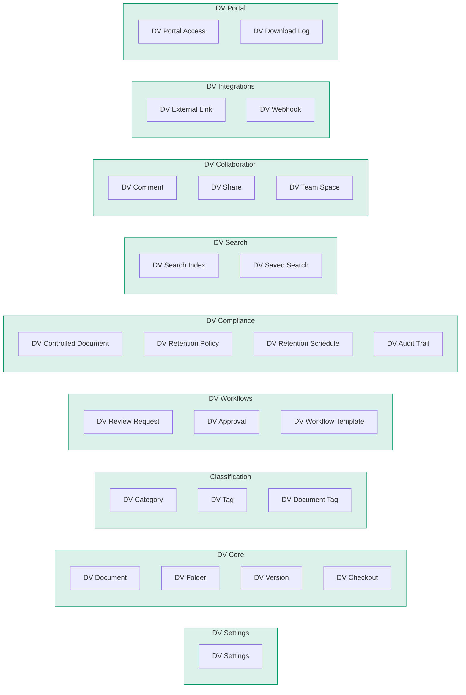

# DocVault — Module Map
# خريطة الوحدات — DocVault

```mermaid
graph LR
    subgraph DV_Settings["DV Settings"]
        s1["DV Settings"]
    end
    subgraph DV_Core["DV Core"]
        dc1["DV Document"]
        dc2["DV Folder"]
        dc3["DV Version"]
        dc4["DV Checkout"]
    end
    subgraph Classification
        cl1["DV Category"]
        cl2["DV Tag"]
        cl3["DV Document Tag"]
    end
    subgraph DV_Workflows["DV Workflows"]
        wf1["DV Review Request"]
        wf2["DV Approval"]
        wf3["DV Workflow Template"]
    end
    subgraph DV_Compliance["DV Compliance"]
        co1["DV Controlled Document"]
        co2["DV Retention Policy"]
        co3["DV Retention Schedule"]
        co4["DV Audit Trail"]
    end
    subgraph DV_Search["DV Search"]
        se1["DV Search Index"]
        se2["DV Saved Search"]
    end
    subgraph DV_Collaboration["DV Collaboration"]
        cb1["DV Comment"]
        cb2["DV Share"]
        cb3["DV Team Space"]
    end
    subgraph DV_Integrations["DV Integrations"]
        in1["DV External Link"]
        in2["DV Webhook"]
    end
    subgraph DV_Portal["DV Portal"]
        po1["DV Portal Access"]
        po2["DV Download Log"]
    end

    style DV_Settings fill:#05966922,stroke:#059669
    style DV_Core fill:#05966922,stroke:#059669
    style Classification fill:#05966922,stroke:#059669
    style DV_Workflows fill:#05966922,stroke:#059669
    style DV_Compliance fill:#05966922,stroke:#059669
    style DV_Search fill:#05966922,stroke:#059669
    style DV_Collaboration fill:#05966922,stroke:#059669
    style DV_Integrations fill:#05966922,stroke:#059669
    style DV_Portal fill:#05966922,stroke:#059669
```
